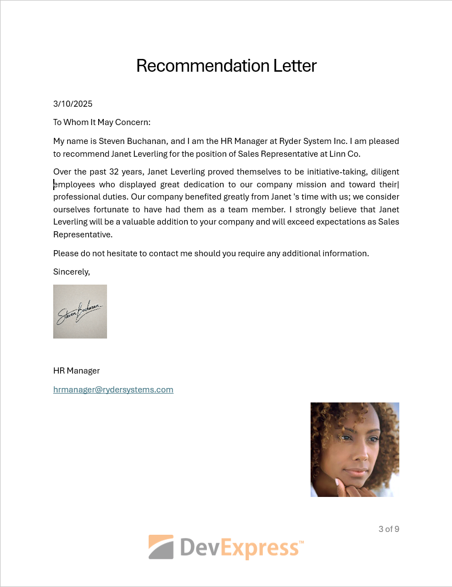

<!-- default badges list -->

<!-- default badges end -->
# Word Processing Document API - How to Automate Mail Merge: Generate, Populate, and Export Documents

This sample project demonstrates how to use the mail merge feature to generate a template, populate it with data, and export the result to a DOCX file.

## Implementation Details

The [RichEditDocumentServer.LoadDocument](https://docs.devexpress.com/OfficeFileAPI/DevExpress.XtraRichEdit.RichEditDocumentServer.LoadDocument.overloads) method call loads a document template. The `AddMailMergeFields` method implementation inserts the **INCLUDEPICTURE** and **MERGEFIELD** fields into the template's main body, and the **INCLUDEPICTURE** field to the footer.

The document template contains the DOCVARIABLE field that inserts the number of years the employee has worked at the company. The nested MERGEFIELD refers to the **HireDate** entry in the database. This field value is calculated in the [CalculateDocumentVariable](https://docs.devexpress.com/OfficeFileAPI/DevExpress.XtraRichEdit.RichEditDocumentServer.CalculateDocumentVariable) event handler.

The `ImageStreamProvider` class is used to insert images from a database. The `GetStream` method parses the received URI (the INCLUDEPICTURE field), finds the required data row, and returns the `MemoryStream` containing an image.

This project uses an XML file as the data source. The mail merge result is saved to the DOCX file.

## Files to Review

| C# | Visual Basic |
|---------|----------|
| [Program.cs](./CS/WordProcessingMailMerge/Program.cs) | [Program.vb](./VB/WordProcessingMailMerge/Program.vb) |
| [ImageStreamProvider.cs](./CS/WordProcessingMailMerge/ImageStreamProvider.cs) | [ImageStreamProvider.vb](./VB/WordProcessingMailMerge/ImageStreamProvider.vb) |

## More Examples

* [How to Use DOCVARIABLE Fields in a Document](https://github.com/DevExpress-Examples/word-document-api-use-docvariable-fields)
* [How to: Embed Images into a Mail Merge Template](https://github.com/DevExpress-Examples/how-to-use-images-in-richedit-mail-merge)
* [How to: Send a Mail-Merge Document as an E-mail](https://github.com/DevExpress-Examples/word-document-api-send-mail-merge-document-as-email)
* [How to: Import HTML Files that Contain Images Referenced with a Custom Prefix](https://github.com/DevExpress-Examples/how-to-import-html-files-that-contain-images-referenced-with-custom-prefix)

## Documentation

* [Mail Merge in Word Processing Document API](https://docs.devexpress.com/OfficeFileAPI/15277/word-processing-document-api/mail-merge)
* [How to: Insert Dynamic Content](https://docs.devexpress.com/OfficeFileAPI/401197/word-processing-document-api/examples/text/how-to-insert-dynamic-content)
* [How to: Replace a Placeholder with a Document Element](https://docs.devexpress.com/OfficeFileAPI/404369/word-processing-document-api/examples/search-and-replace/how-to-replace-a-placeholder-with-a-document-element)
<!-- feedback -->
## Does This Example Address Your Development Requirements/Objectives?

 

(you will be redirected to DevExpress.com to submit your response)
<!-- feedback end -->
